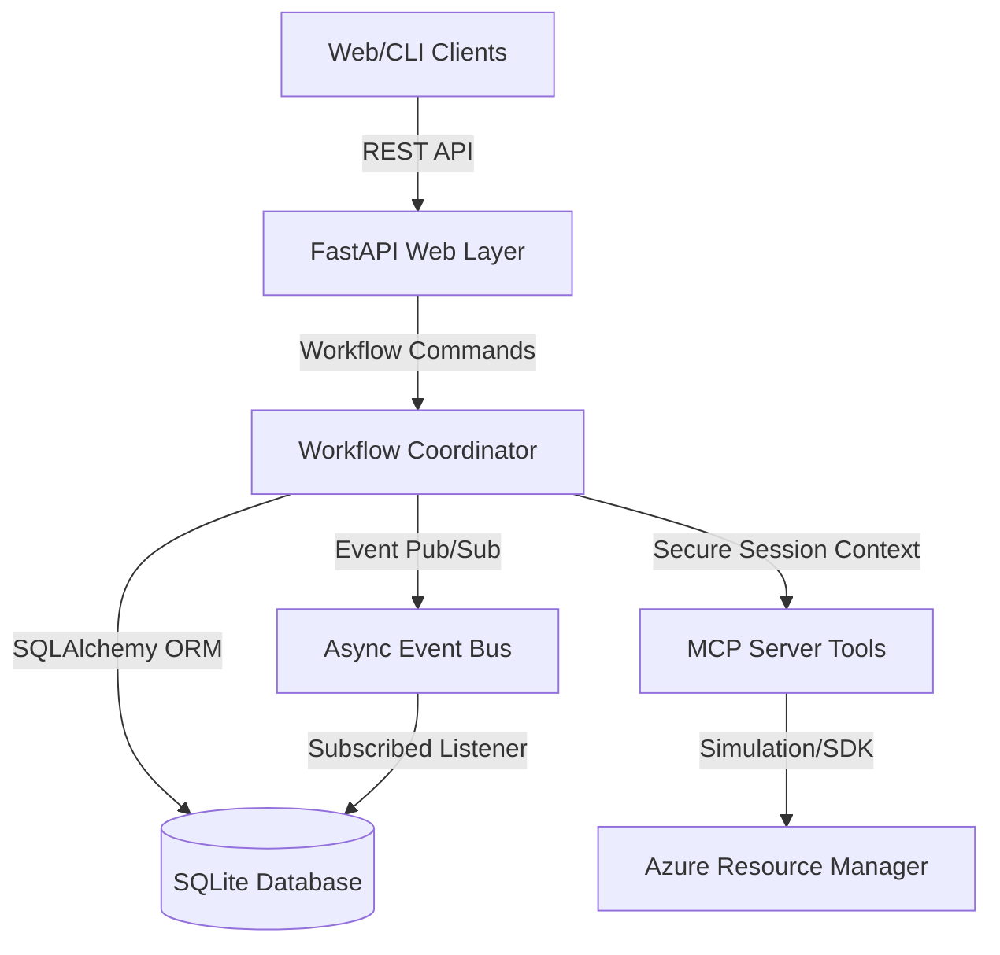

# CloudOps Autopilot

AI-Driven CloudOps Autopilot for Adaptive Provisioning and Cost Governance.

This project delivers a multi-agent workflow coordination engine designed to automate cloud resource governance, discover underutilized assets, and apply adaptive cost remediation (resizing, stopping, or deleting) under secure human-in-the-loop gates.

---

## 1. System Architecture

The codebase utilizes a modular, decoupled architecture consisting of four core layers:



1. **FastAPI Web Application (`backend/app/main.py`)**: Exposes REST interfaces to control, monitor, and approve autopilot execution runs. Configured with OpenAPI tags, DTO validation schemas, and global exception hooks.
2. **Workflow Coordinator (`backend/app/workflow/coordinator.py`)**: A state machine managing execution steps (inventory sweep, analysis, decision-making, planning, approval gates, execution, verification, rollback). It persists all state transitions to the database.
3. **Model Context Protocol (MCP) Server (`mcp_server/server.py`)**: Provides sandboxed tool primitives (e.g. `list_resources`, `execute_plan`, `request_approval`) exposed to agent reasoning. Enforces cryptographic signatures for all write operations.
4. **Database & Events Layer**: Event-driven architecture utilizing an asynchronous `EventBus` where an audit logging listener automatically captures and saves execution footprints directly to an SQLite database.

---

## 2. Package Structure

```text
├── agents/                 # Specialized domain reasoning agents (Audit, Decision, Telemetry)
├── backend/
│   └── app/
│       ├── core/           # Configuration management and JWT settings
│       ├── database.py     # SQLite engine initialization and dependency helpers
│       ├── events/         # Decoupled EventBus publisher-subscriber primitives
│       ├── main.py         # FastAPI application bootstrap, routers, and exception handlers
│       ├── models/         # SQLAlchemy ORM schemas (Runs, Approvals, Recommendations, etc.)
│       ├── schemas/        # API Request/Response DTO models (Pydantic V2)
│       └── workflow/       # State machine models and WorkflowCoordinator persistence
├── cloud_adapter/          # Cloud client interfaces and simulated Azure resource clients
├── mcp_server/             # MCP specification handlers, tool schemas, and token validation wrappers
├── shared/                 # Configurations, constants, and shared schemas
└── tests/                  # Programmatic test suite (unit and integration tests)
```

---

## 3. Database Persistence

All workflow logs and entity relationships are stored in the `cloudops_autopilot.db` SQLite database using SQLAlchemy ORM.
* **Runs**: Captures run IDs, startup parameters, scenario name, and completion status.
* **Resources**: Keeps track of discovered VMs, unattached disks, and App Service Plans with their specifications.
* **Recommendations**: Relates savings amounts, rationale, risk levels, and actions to specific resources and runs.
* **Approvals**: Tracks approval tasks, operators, execution timestamps, and cryptographic proof tokens.
* **Audit Logs**: Automatically created by a listener subscribed to `ToolStarted`, `ToolCompleted`, `ToolFailed`, `WorkflowStarted`, and `WorkflowCompleted` events.

---

## 4. Secure JWT Approval System

State modification tools (e.g. `execute_plan`) require a cryptographically signed JSON Web Token (JWT) before execution.
* **JWT Tokens**: Signed using `HS256` with a configured `JWT_SECRET_KEY` and expire after **10 minutes**.
* **API Route (`POST /api/v1/approvals/{id}/approve`)**: Generates and issues pure JWTs to API clients.
* **Backward Compatibility**: To support legacy tests that expect tokens to begin with a `token-` prefix, the core validation functions in `mcp_server/server.py` accept a compatibility helper (`get_compat_token`) that wraps raw tokens, and automatically strips the prefix during token decoding.

---

## 5. Development & Execution Guide

### Prerequisites
* Python 3.10 or higher
* [uv](https://github.com/astral-sh/uv) package manager installed

### Installation & Setup
Initialize the virtual environment and install required dependencies:
```bash
uv venv
uv pip install -e .
```

### Running the API Server
Start the Uvicorn web server locally. Ensure you set the `JWT_SECRET_KEY` environment variable:
```bash
# Windows PowerShell
$env:JWT_SECRET_KEY="your_jwt_secret_key_here"
uv run uvicorn backend.app.main:app --host 127.0.0.1 --port 8000
```
Visit the interactive Swagger UI documentation at: `http://127.0.0.1:8000/docs`.

### Running Tests
Execute the entire test suite:
```bash
uv run pytest
```

### Running the Frontend Dashboard
Navigate to the `frontend` directory, install Node modules, and launch the Vite development server:
```bash
cd frontend
npm install
npm run dev
```
Open your browser and navigate to `http://localhost:5173` (or the port specified by Vite) to view the interactive dashboard.

---

## 6. Configuring Cloud Execution Modes
The system can operate in two different cloud modes managed in the `.env` configuration file:
*   **`CLOUD_MODE=LIVE`**: Integrates directly with the Azure Resource Manager SDK using `DefaultAzureCredential`. Auto-discovers running resources and queries Azure Monitor timeseries telemetry.
*   **`CLOUD_MODE=MOCK`**: Emulates Azure operations in memory using a simulated client structure. Ideal for offline validation, unit testing, and sandbox environments without subscription access.

If the live Azure client encounters connection or authentication errors during `LIVE` execution, it will automatically fall back to the `MOCK` client state to ensure uninterrupted operation.

